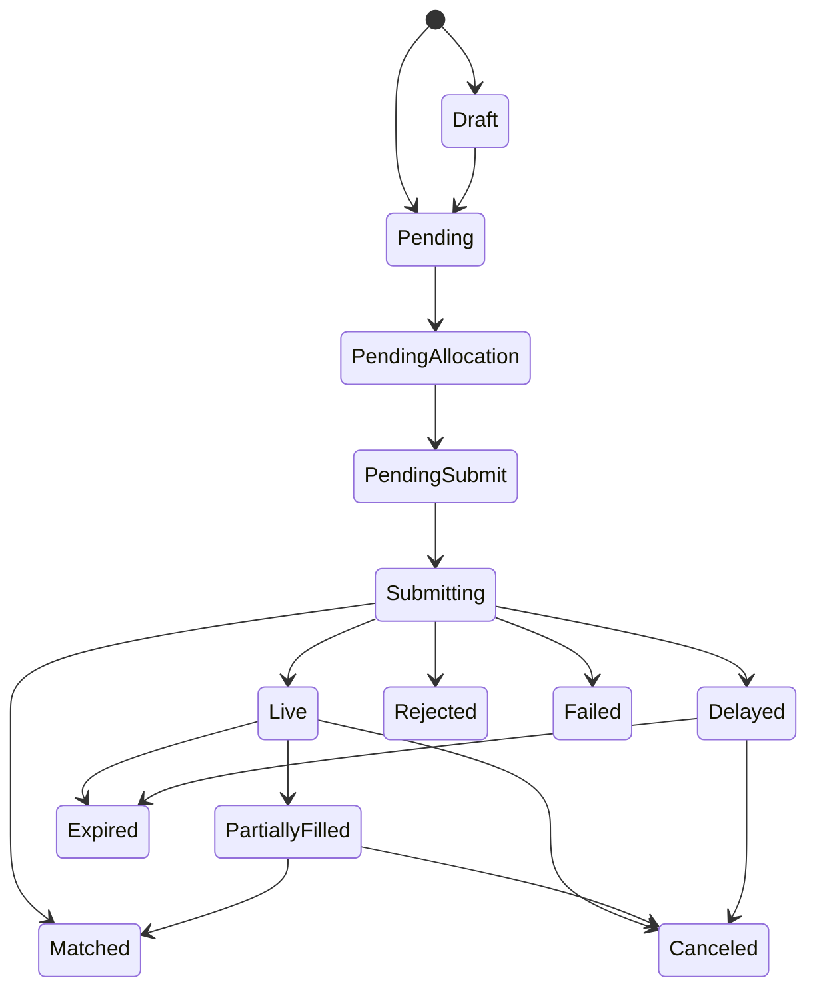

# Polymarket Orders Controller Plan

## Goal

Add a `polymarket-order-controller` that reconciles `polymarket/v1/Order` records into real Polymarket CLOB orders, materializes derived `polymarket/v1/Trade` records for each external `tradeID`, keeps local status in sync from both WebSocket and REST, and manages the matching `core/v1/Allocation` named `polymarket-order-{order-object-name}` in the same tradespace plus any compensating cleanup allocations needed to release reserved balance.

This plan assumes we follow the existing repo shape:

- gRPC clients in controllers
- business logic in `pkg/controller`
- binaries in `cmd/*`
- controller-specific schemas and fixtures in `controllers/polymarket/*`

## Authentication NOTE

Polymarket order creation cannot be done with API credentials alone.

According to the Polymarket authentication docs, L2 API credentials (`apiKey`, `secret`, `passphrase`) are enough for authenticated REST calls like:

- `GET /data/orders`
- `DELETE /order`
- `DELETE /orders`

But creating an order still requires local L1 signing of the order payload with the wallet private key / signer. So:

- If "credentials" means only `apiKey/secret/passphrase`, we can list/cancel/watch, but we cannot create orders.
- To place orders, the controller also needs the signing key plus the correct `signatureType` and `funder` address.

Plan assumption for implementation: the controller will run with both:

- L1 signing material
- L2 API credentials

If that assumption is wrong, order placement must be split into a separate signer or pre-signed-order flow.

## Relevant Polymarket Facts From The Docs

### Authentication

- L2 auth uses 5 headers: `POLY_ADDRESS`, `POLY_SIGNATURE`, `POLY_TIMESTAMP`, `POLY_API_KEY`, `POLY_PASSPHRASE`.
- L2 request signatures are HMAC-SHA256 using the API `secret`.
- L1 auth uses EIP-712 signing and is still required for order payload signing.
- Signature types:
  - `0` = `EOA`
  - `1` = `POLY_PROXY`
  - `2` = `GNOSIS_SAFE`

### Order Submission

`POST /order` request body contains:

- `order.maker`
- `order.signer`
- `order.taker`
- `order.tokenId`
- `order.makerAmount`
- `order.takerAmount`
- `order.side`
- `order.expiration`
- `order.nonce`
- `order.feeRateBps`
- `order.signature`
- `order.salt`
- `order.signatureType`
- top-level `owner`
- top-level `orderType`
- top-level `deferExec`

Implementation note from `py-clob-client`:

- the request body's top-level `owner` should be set to the API key ID
- in practice this means `owner = POLY_API_KEY`, not a separate env var

`POST /order` response returns:

- `success`
- `orderID`
- `status`
- `makingAmount`
- `takingAmount`
- `transactionsHashes`
- `tradeIDs`
- `errorMsg`

Documented response statuses include:

- `live`
- `matched`
- `delayed`

The order lifecycle docs also mention:

- `unmatched`

So the controller should preserve the raw external status string and avoid assuming the set is closed to only three values.

### WebSocket User Channel

Endpoint:

- `wss://ws-subscriptions-clob.polymarket.com/ws/user`

Important message families:

- `order` events
- `trade` events

Order event raw `type` values:

- `PLACEMENT`
- `UPDATE`
- `CANCELLATION`

Trade status lifecycle:

- `MATCHED`
- `MINED`
- `CONFIRMED`
- `RETRYING`
- `FAILED`

These trade statuses should live on derived `polymarket/v1/Trade` records instead of being collapsed into the top-level order state machine.

### REST Sync

`GET /data/orders` returns open orders only, paginated by `next_cursor`, and includes:

- `id`
- `status`
- `owner`
- `maker_address`
- `market`
- `asset_id`
- `side`
- `original_size`
- `size_matched`
- `price`
- `outcome`
- `expiration`
- `order_type`
- `associate_trades`
- `created_at`

`DELETE /order` cancels one order by `orderID`.

`DELETE /orders` cancels many orders and returns:

- `canceled`
- `not_canceled`

### Market Metadata Needed For Signing

Without an SDK, the controller must fetch or derive:

- fee rate for the token
- tick size
- negative-risk flag / market characteristics
- token and condition identifiers

This metadata is required to build the exact signed payload and to avoid avoidable rejection errors.

## Current Marketplane Constraints

Two existing platform limits shape this controller plan:

1. Direct `Delete` is unsafe for controller-managed remote resources until Marketplane has record finalizers.
   For `polymarket/v1/Order`, Phase 1 does not provide a declarative cancel/delete field in spec.
   `spec.active` only gates initial submission and does not mean "cancel" or "delete".
   Raw `Delete` RPC usage should be treated as an unsupported destructive action for now.
2. Record updates are still full-object overwrites.
   Until Marketplane gains resource versions / three-way merge, controller status writes are best-effort and may race user edits.
   Phase 1 should keep writes coarse-grained and treat most order spec fields as immutable after submission.

## Interim Update Discipline

Until Marketplane has resource versions / three-way merge, this controller should follow a strict Phase 1 ownership model:

- users own `spec.*`
- the controller owns `status.*`
- the controller also owns child `core/v1/Allocation` records derived from the order

Phase 1 mutability rules:
- `active` is the only supported spec field that may change after creation
- `active: false -> true` is supported before the first successful remote submit
- once `status.polymarketOrderID` exists, the order spec should be treated as immutable in Phase 1

Phase 1 write rules:

- the controller must serialize reconciliation per order key so WS events, REST sync, and local retries do not race each other
- before writing status, the controller should re-read the latest order record and preserve the latest `spec` unchanged
- status writes should only merge controller-owned status fields and should never rewrite user-authored spec fields
- if the latest record still has `active = false` and no remote order has been submitted yet, the controller should preserve that draft intent rather than racing ahead with allocation or submission

Residual risk:

- a user edit can still land between the controller read and controller update because the storage layer does not yet provide CAS
- Phase 1 reduces this risk by making submitted specs effectively immutable after the first successful remote submit
- full correctness for concurrent spec/status writers still depends on future resource-version / three-way-merge support

## Key Design Decision

Use two layers of status:

1. `status.state`
   Controller-owned lifecycle state used by reconciliation.
2. `status.external.*`
    Raw Polymarket fields copied from REST/WS responses without collapsing them too early.

This keeps the controller deterministic while preserving the real exchange state for calculations such as **max potential exposure**.

Use two resource layers:

1. `polymarket/v1/Order`
   User intent plus controller-owned remote-order lifecycle.
2. `polymarket/v1/Trade`
   Controller-owned projection of each Polymarket trade keyed by external `tradeID`.

This keeps trade-settlement lifecycle separate from order lifecycle and gives reconciliation a stable idempotency key for fills.

## Proposed Repo Layout

### Runtime Code

- `pkg/controller/polymarket_order.go`
- `pkg/controller/polymarket_order_test.go`
- `pkg/polymarket/client.go`
- `pkg/polymarket/auth.go`
- `pkg/polymarket/signing.go`
- `pkg/polymarket/ws.go`
- `pkg/polymarket/types.go`
- `cmd/polymarket-order-controller/main.go`

## Proposed `polymarket/v1/Order` Record

### MetaRecord

Add a `core/v1/MetaRecord` for `polymarket/v1/Order`.

### Spec

Recommended spec:

```json
{
  "assetId": "token-id",
  "side": "BUY",
  "price": "0.57",
  "size": "10",
  "orderType": "GTC",
  "expiration": 17.... | null,
  "active": true
}
```

Required:

- `assetId`
- `side` enum `BUY|SELL`
- `price` decimal string
- `size` decimal string
- `orderType` enum `GTC|FOK|GTD|FAK`  (default `GTC`)
- `active` boolean

Optional:

- `expiration`

Notes:

- Keep monetary and size values as strings, not floats.
- `active = false` means "draft / do not submit yet".
- `active = true` means the controller may allocate and submit the order if it has not already done so.
- `active` is a creation gate, not a cancellation signal.
- `spec.active` may remain `true` even if `status.state` later becomes `Canceled`, `Expired`, `Rejected`, or `Failed`.
- Direct `Delete` of `polymarket/v1/Order` remains unsafe until finalizers exist.
  In Phase 1 there is no safe declarative delete path in spec.

### Status

Recommended status:

```json
{
  "state": "Pending",
  "message": "",
  "polymarketOrderID": "0x...",
  "external": {
    "orderID": "0x...",
    "orderStatus": "live",
    "lastOrderEventType": "PLACEMENT",
    "makerAddress": "0x...",
    "owner": "api-key-id",
    "market": "0x-condition-id",
    "assetId": "token-id",
    "side": "BUY",
    "price": "0.57",
    "originalSize": "10",
    "matchedSize": "3",
    "remainingSize": "7",
    "outcome": "YES",
    "orderType": "GTC",
    "tradeIDs": ["trade-123"],
    "transactionHashes": ["0x..."]
  },
  "observedAt": {
    "restSync": "2026-04-13T00:00:00Z",
    "wsEvent": "2026-04-13T00:00:00Z"
  }
}
```

Notes:

- `polymarketOrderID` is the controller's canonical remote identifier, copied from the `POST /order` response.
- `external.orderID` preserves the raw Polymarket field as returned by REST/WS payloads.
- trade lifecycle is tracked on child `polymarket/v1/Trade` records, not folded into `Order.status.state`

## Proposed `polymarket/v1/Trade` Record

### MetaRecord

Add a controller-owned `core/v1/MetaRecord` for `polymarket/v1/Trade`.

This record is not user-authored intent. It is a deterministic projection created by the controller when Polymarket emits or backfills a `tradeID`.

Recommended naming:

- `metadata.name = polymarket-trade-{tradeID}`
- same tradespace as the parent `polymarket/v1/Order`

Recommended labels:

- `polymarket.marketplane.io/order-name = <local order name>`
- `polymarket.marketplane.io/order-id = <polymarketOrderID>`
- `polymarket.marketplane.io/trade-id = <tradeID>`

### Spec

Recommended immutable spec:

```json
{
  "orderName": "my-order",
  "polymarketOrderID": "0x...",
  "tradeID": "trade-123",
  "market": "0x-condition-id",
  "assetId": "token-id",
  "side": "BUY",
  "price": "0.57",
  "size": "3",
  "makerAddress": "0x..."
}
```

Required:

- `orderName`
- `polymarketOrderID`
- `tradeID`
- `market`
- `assetId`
- `side` enum `BUY|SELL`
- `price` decimal string
- `size` decimal string

Notes:

- the immutable `tradeID` is the reconciliation key for websocket replay and REST backfill
- the controller should create this record once and then treat the spec as immutable

### Status

Recommended status:

```json
{
  "state": "Matched",
  "message": "",
  "settlementAllocationName": "",
  "settlementApplied": false,
  "external": {
    "tradeID": "trade-123",
    "tradeStatus": "MATCHED",
    "transactionHash": "0x...",
    "matchTime": "2026-04-13T00:00:00Z"
  },
  "observedAt": {
    "restSync": "2026-04-13T00:00:00Z",
    "wsEvent": "2026-04-13T00:00:00Z"
  }
}
```

Notes:

- `status.state` mirrors the controller-owned trade lifecycle
- `status.external.tradeStatus` preserves the raw Polymarket trade status string
- `settlementApplied` becomes true only after the controller has created the settlement `core/v1/Allocation`
- `FAILED` is terminal for the trade record and should not create settlement credit

## Order Controller State Machine

Recommended controller-owned `status.state` values:

- `Draft`
- `Pending`
- `PendingAllocation`
- `PendingSubmit`
- `Submitting`
- `Live`
- `Delayed`
- `PartiallyFilled`
- `Matched`
- `Canceled`
- `Expired`
- `Rejected`
- `Failed`

### State Semantics

- `Draft`
  Record exists locally with `spec.active = false`; controller does not allocate or submit.
- `Pending`
  Order exists locally with `spec.active = true`, allocation not yet created.
- `PendingAllocation`
  Allocation exists but is not yet approved.
- `PendingSubmit`
  Allocation approved; order is ready to sign and submit.
- `Submitting`
  In-flight `POST /order`.
- `Live`
  Remote order is resting on the book.
- `Delayed`
  Polymarket accepted the order but delayed matching.
- `PartiallyFilled`
  `size_matched > 0` and still open.
- `Matched`
  Fully matched on the venue. Per-trade settlement confirmation is tracked on `polymarket/v1/Trade`.
- `Canceled`
  Remote order was canceled on the venue while `spec.active` may still remain `true`.
- `Expired`
  GTD order expired.
- `Rejected`
  Local validation or exchange processing rejected the order.
- `Failed`
  Terminal controller or exchange failure for the order lifecycle.

### Suggested Transition Skeleton



## Trade Controller State Machine

Recommended controller-owned `status.state` values:

- `Matched`
- `Mined`
- `Retrying`
- `Confirmed`
- `Failed`

### State Semantics

- `Matched`
  Trade matched and accepted for settlement, but no successful onchain execution observed yet.
- `Mined`
  Trade was observed onchain but has not reached finality.
- `Retrying`
  Trade execution failed transiently and Polymarket is retrying.
- `Confirmed`
  Terminal success. Settlement credit may be applied exactly once.
- `Failed`
  Terminal failure. No settlement credit should be applied.

## Allocation And Release Plan

Allocation record name:

- `polymarket-order-{order-object-name}`

Allocation record tradespace:

- same as the `polymarket/v1/Order`

Allocation record target:

- `targetType = "polymarket/v1/Order"`
- `targetName = <order object name>`

### Buy Orders

Reserve quote currency:

- `currency = "USDC"`
- `amount = -max_notional`

Where:

- `max_notional = price * size`

**exact decimal math only**

### Sell Orders

Reserve outcome inventory:

- `currency = "polymarket-token/{assetId}"`
- `amount = -size`

This uses the existing generic `Allocation.currency` string rather than inventing a new ledger type immediately.

### Settlement On Fill

When a Polymarket trade is observed, the controller should first materialize a `polymarket/v1/Trade` record and only create a positive settlement `core/v1/Allocation` once that trade reaches terminal successful state `Confirmed`.

Recommended naming:

- `polymarket-order-{order-name}-fill-{tradeID}`

Recommended target:

- `targetType = "polymarket/v1/Order"`
- `targetName = <order object name>`

Currency semantics:

- BUY fill:
  create a positive allocation in `polymarket-token/{assetId}`
- SELL fill:
  create a positive allocation in `USDC`

Amount semantics:

- derive the amount from the exact Polymarket trade payload for that fill
- do not recompute settlement from `float64 price * size`
- use deterministic naming by `tradeID` so websocket replay and REST backfill remain idempotent
- apply the settlement allocation only once the corresponding `polymarket/v1/Trade.status.state = Confirmed`

Example BUY fill settlement:

```json
{
  "currency": "polymarket-token/123456789...",
  "amount": "3",
  "targetType": "polymarket/v1/Order",
  "targetName": "my-order"
}
```

Example SELL fill settlement:

```json
{
  "currency": "USDC",
  "amount": "1.71",
  "targetType": "polymarket/v1/Order",
  "targetName": "my-order"
}
```

The original reservation allocation remains the hold for the unfilled remainder of the order.
This means:

- confirmed trades credit the received asset exactly once
- remaining reserved balance stays locked in the original reservation allocation
- cancellation / expiry later releases only the unfilled remainder

### Release Primitive

Use a second `core/v1/Allocation` as the release primitive instead of introducing a new core type in Phase 1.

Suggested compensating allocation:

```json
{
  "currency": "USDC",
  "amount": "5.70",
  "targetType": "core/v1/Allocation",
  "targetName": "polymarket-order-my-order"
}
```

Semantics:

- a release is just another allocation with a positive amount
- it appends a compensating ledger entry in the same currency
- it can represent full or partial release
- it should point back to the original reservation allocation for traceability

Recommended naming:

- reservation: `polymarket-order-{order-name}`
- release: `polymarket-order-{order-name}-release-{reason}`

Examples:

- `polymarket-order-my-order-release-canceled`
- `polymarket-order-my-order-release-expired`
- `polymarket-order-my-order-release-remainder`

### Release Behavior

- If order validation fails before the allocation is approved, no compensating allocation is needed.
- If order is rejected after the allocation was already approved but before remote placement, create a positive compensating `Allocation` for the full reserved amount.
- If order is canceled or expires after partial execution, create a positive compensating `Allocation` only for the remaining reserved amount; the filled portion is already represented by per-trade settlement allocations.
- If order is fully filled, no compensating allocation is needed unless there is leftover reserved balance due to rounding or fee handling.
- If the existing allocation controller remains authoritative for approval, the Polymarket controller should wait for allocation `phase=approved` before placing the order.
- Cleanup phase therefore depends on the existing allocation controller continuing to approve both negative reservation allocations and positive compensating allocations.

## Reconciliation Flow

### 1. Record Watch

Watch `polymarket/v1/Order` records from Marketplane.

React to:

- create
- updates that change `spec.active` before first submit

### 2. Ensure Allocation

For draft orders where `spec.active = false`:

- do not create allocation
- do not submit to Polymarket

For active orders that have not yet been submitted:

- compute required allocation amount
- create `core/v1/Allocation` if missing
- wait for allocation approval

### 3. Fetch Metadata Needed For Signing

For each order before submission:

- validate market and token IDs
- fetch fee rate
- fetch tick size
- fetch negative-risk / market flags

Cache metadata by `assetId` and `market` with TTL to avoid re-fetching on every loop.

### 4. Sign And Post Order

Build the raw Polymarket signed order using:

- signer address
- funder address
- signature type
- maker/taker amounts
- nonce
- salt
- fee rate
- expiration

Then `POST /order`.

Persist back:

- `polymarketOrderID` copied from the response `orderID`
- raw response `orderID` under `status.external.orderID`
- raw order status
- making/taking amounts
- any returned `tradeIDs`
- any returned `transactionsHashes`

### 5. Track Progress From WebSocket

Use the authenticated user channel as the primary real-time source.

Handle:

- order placement events
- order partial-fill updates
- order cancellation events
- trade settlement progression via upsert into `polymarket/v1/Trade`

### 6. Materialize Trade Records

For each newly observed trade:

- create or update a deterministic `polymarket/v1/Trade` record keyed by Polymarket `tradeID`
- copy raw trade lifecycle into `Trade.status.external.*`
- link it back to the local order by `spec.orderName` and labels
- update order status with cumulative matched / remaining amounts

### 7. Apply Settlement Allocations

For each trade record that newly reaches `Confirmed`:

- create a deterministic fill allocation named from the local order name plus Polymarket `tradeID`
- mark `Trade.status.settlementApplied = true` once the allocation is created
- for BUY fills, credit `polymarket-token/{assetId}`
- for SELL fills, credit `USDC`

For each trade record that reaches `Failed`:

- do not create settlement credit
- preserve the terminal failure on the trade record for debugging and reconciliation

### 8. Maintain Heartbeat

Polymarket documents a heartbeat mechanism for order safety.

- while the controller owns live orders, it should keep the heartbeat alive on the documented interval
- heartbeat loss should be treated as an at-risk condition because Polymarket may cancel open orders if liveness expires

### 9. Periodic REST Sync

Three sync passes are recommended:

1. single-order lookup by persisted `polymarketOrderID`
   - primary recovery path for records that were successfully submitted at least once
   - used to recover cancels, expiries, and other non-open terminal states that may disappear from the open-orders list
2. `GET /data/orders`
   - source of truth for currently open orders
   - restores `size_matched` and open-order presence after reconnects
3. `GET /trades`
   - backfill for trades that may have occurred while the controller was down
   - requires `maker_address` in the query, so the controller must know its canonical Polymarket maker address
   - required because `GET /data/orders` only returns open orders
   - restores missing `polymarket/v1/Trade` records and any missing settlement allocations for confirmed trades

This is important: using only `GET /data/orders` is not enough to recover full fills that completed while the controller was offline, because fully matched orders disappear from the open-orders list.

This plan assumes the documented single-order lookup remains usable for previously submitted order IDs.
If that assumption proves false in practice, the controller needs an explicit fallback policy for records whose known `polymarketOrderID` disappears from both open-order and trade sync.

## Polymarket Client Package Plan

Create a small internal Go client instead of depending on an SDK:

- `pkg/polymarket/auth.go`
  - L1 EIP-712 auth helpers
  - L2 HMAC request signing
- `pkg/polymarket/signing.go`
  - exact signed order construction
  - maker/taker amount math
  - nonce / salt handling
- `pkg/polymarket/client.go`
  - REST endpoints
- `pkg/polymarket/ws.go`
  - user channel connect / reconnect / resubscribe
- `pkg/polymarket/types.go`
  - raw REST and WS payload structs

### Config Inputs

Expected controller config / env vars:

- `POLY_HOST`
- `POLY_WSS_URL`
- `POLY_CHAIN_ID`
- `POLY_ADDRESS`
- `POLY_MAKER_ADDRESS`
- `POLY_PRIVATE_KEY`
- `POLY_API_KEY`
- `POLY_API_SECRET`
- `POLY_API_PASSPHRASE`
- `POLY_SIGNATURE_TYPE`
- `POLY_FUNDER`

`POST /order.owner` should be populated from `POLY_API_KEY`, matching the current `py-clob-client` SDK behavior.

## Failure Handling

### Idempotency

- Reconcile by local record key, not by event count.
- Never submit a second remote order once `status.polymarketOrderID` exists, unless an explicit replace strategy is added later.
- If a create request succeeds remotely but status update fails locally, targeted single-order sync must restore the missing remote order ID.
- Each `polymarket/v1/Trade` record should be named deterministically from external `tradeID`, so duplicate WS events and REST trade backfills collapse onto the same record.
- Each fill settlement allocation should be named deterministically from the local order name and external `tradeID`, and should only be applied once for trades that reach `Confirmed`.
- `spec.active` only affects whether the first submission should happen; it does not imply later cancellation or re-submission semantics.

### Retry Policy

- WebSocket reconnect with exponential backoff.
- Heartbeat retry on a short interval while live orders exist; repeated heartbeat failure should surface as a degraded controller condition.
- REST 5xx retry with jitter.
- 4xx validation failures become `Rejected`.
- `503 cancel-only mode` should flip creates into a retryable blocked state but still allow cancels.
- `active = false` draft records should remain inert during retry loops.

### Exact Arithmetic

- All order, allocation, and fill math must use decimal/string math.
- Never use `float64` for price, size, or notional.
- Settlement allocations should use exact execution amounts from Polymarket trade data rather than recomputed approximate notional.

## Tests To Write

### Unit

- signed order payload generation
- L2 HMAC signing
- state transitions from raw WS events
- trade-record projection from raw WS and REST trade payloads
- amount/allocation derivation for BUY and SELL
- fill settlement allocation derivation for BUY and SELL
- settlement only on trade `Confirmed`
- `active` gate handling before first submit

### Integration

- create draft order with `active=false` and verify no allocation or remote submit occurs
- flip `active=false -> true` before first submit and verify normal creation path
- create order -> allocation approved -> remote order live
- partial fill via WS + REST resync
- trade record created from first observed `tradeID`
- settlement not applied while trade is `MATCHED|MINED|RETRYING`
- settlement applied once when trade becomes `CONFIRMED`
- failed trade leaves no positive settlement allocation
- partial BUY fill credits `polymarket-token/{assetId}`
- partial SELL fill credits `USDC`
- controller restart while order is still live
- controller restart after full fill
- controller restart after cancel recovered via `polymarketOrderID`
- controller restart after GTD expiry recovered via `polymarketOrderID`
- cancel single order
- batch cancel during resync
- delayed order lifecycle
- canceled or failed order may still retain `spec.active=true`

### Fixtures

Capture and freeze sample payloads for:

- `POST /order` success
- `DELETE /order`
- `DELETE /orders`
- `GET /data/orders`
- `GET /trades`
- user-channel `order`
- user-channel `trade`

## Implementation Phases

### Phase 0: Reuse Allocation For Release

- define the compensating-allocation naming convention
- document that positive allocations can be used to release earlier reservations
- ensure reconciliation uses deterministic names so releases stay idempotent

### Phase 1: Scaffolding

- add `controllers/polymarket/` assets directory
- add `MetaRecord` for `polymarket/v1/Order`
- add `MetaRecord` for `polymarket/v1/Trade`
- add schema fixtures and raw payload fixtures
- add `cmd/polymarket-order-controller`

### Phase 2: Polymarket Client

- implement REST auth
- implement order signing
- implement raw REST endpoints
- implement WS user client

### Phase 3: Controller Core

- watch Marketplane orders
- create/wait on allocations
- post orders
- write local status
- materialize derived trade records

### Phase 4: Sync + Recovery

- single-order lookup by `polymarketOrderID`
- open-order resync
- trade backfill
- reconnect recovery
- duplicate suppression
- settlement replay from confirmed trade records

### Phase 5: Cleanup Semantics

- external cancel / expiry cleanup flow
- allocation release flow


## References

- [Authentication](https://docs.polymarket.com/api-reference/authentication)
- [User Channel](https://docs.polymarket.com/market-data/websocket/user-channel)
- [Post a new order](https://docs.polymarket.com/api-reference/trade/post-a-new-order)
- [Cancel single order](https://docs.polymarket.com/api-reference/trade/cancel-single-order)
- [Cancel multiple orders](https://docs.polymarket.com/api-reference/trade/cancel-multiple-orders)
- [Get user orders](https://docs.polymarket.com/api-reference/trade/get-user-orders)
- [Get trades](https://docs.polymarket.com/api-reference/trade/get-trades)
- [Orders Overview](https://docs.polymarket.com/trading/orders/overview)
- [Order Lifecycle](https://docs.polymarket.com/concepts/order-lifecycle)
- [Get market by id](https://docs.polymarket.com/api-reference/markets/get-market-by-id)
- [Get fee rate](https://docs.polymarket.com/api-reference/market-data/get-fee-rate)
- [Get tick size](https://docs.polymarket.com/api-reference/market-data/get-tick-size)
- [Error Codes](https://docs.polymarket.com/resources/error-codes)
